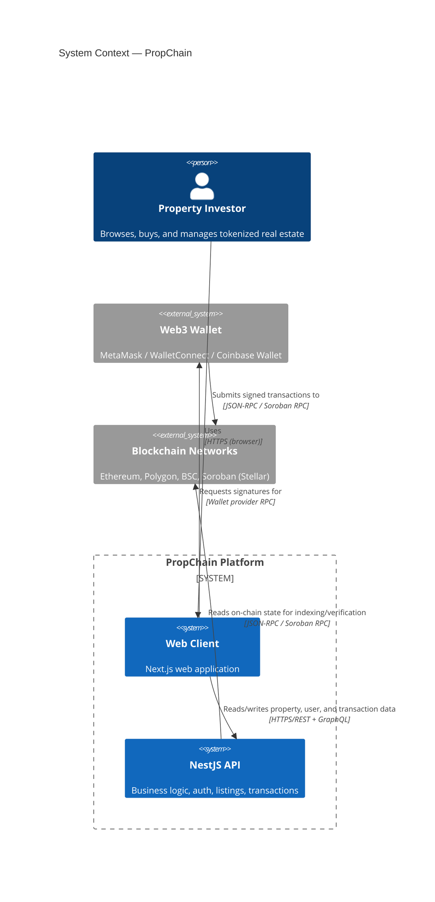
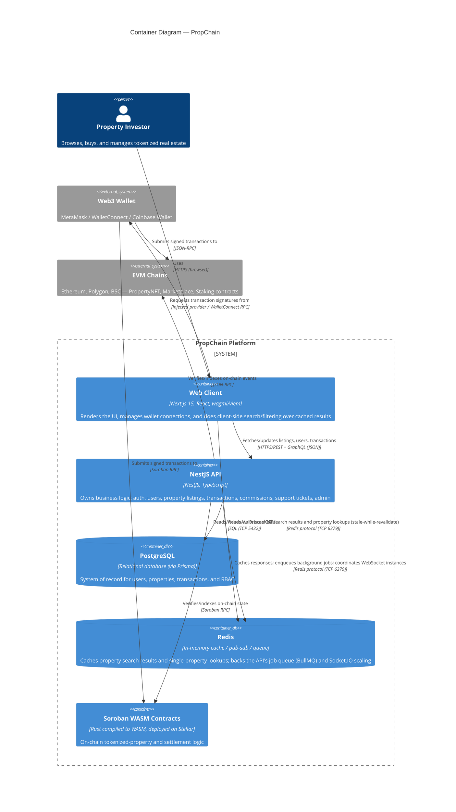

# C4 Model: System Context & Container Architecture

This document gives a high-level view of the PropChain platform using the
[C4 model](https://c4model.com/): a System Context diagram (who uses the
system and what it talks to) and a Container diagram (the deployable units
inside the system and how they communicate).

PropChain is split across three repositories:

| Container | Repository | Stack |
|---|---|---|
| Web Client | [PropChain-FrontEnd](https://github.com/Dataguru-tech/PropChain-FrontEnd) (this repo) | Next.js 15 (App Router), React, wagmi/viem |
| NestJS API | [PropChain-BackEnd](https://github.com/MettaChain/PropChain-BackEnd) | NestJS, Prisma, PostgreSQL, Redis |
| Smart Contracts | PropChain-contract | Soroban (Rust/WASM) on Stellar, plus EVM contracts (Ethereum/Polygon/BSC) |

## System Context

At the highest level, an investor uses the Web Client in their browser. The
Web Client is the only thing end users talk to directly — it in turn talks
to the backend API and, for on-chain actions, to the user's connected wallet
and the blockchain networks.

## Container Diagram

Zooming in on the "PropChain Platform" boundary above: the Web Client is not
a pure static site — it has its own server-side layer (Next.js Route
Handlers / Server Components) that talks to Redis directly to cache property
search results, independent of the backend API's own Redis usage.

## Container Responsibilities

### Web Client (this repository)
- Renders the property marketplace, dashboards, and wallet-connected flows.
- Connects wallets via `wagmi`/`viem` and submits signed transactions
  directly from the browser — it never holds private keys.
- Has its own thin server-side layer (Next.js Route Handlers/Server
  Components) that calls Redis directly (`src/lib/redisCache.ts`) to cache
  property search results with a stale-while-revalidate strategy, and falls
  back to an in-browser IndexedDB cache when offline (`src/lib/propertyCache.ts`).
- Talks to the NestJS API over HTTPS for anything that isn't purely
  on-chain (listings, user profiles, transaction history).

### NestJS API
- Source of truth for business logic: authentication/RBAC (`USER`, `AGENT`,
  `ADMIN`), property listings, transactions, commissions, support tickets,
  and admin operations.
- Persists relational data to PostgreSQL through Prisma.
- Uses Redis for response caching, as a BullMQ job queue backend, and as the
  adapter that lets Socket.IO scale across multiple API instances.
- Exposes both REST and GraphQL endpoints, documented via Swagger
  (`/api/docs`).

### PostgreSQL
- The relational system of record: users, properties, transactions, and
  role-based access control data.
- Accessed only by the NestJS API, never directly by the Web Client.

### Redis
- Shared caching layer used by **both** the Web Client (for property search
  results) and the NestJS API (for response caching, job queuing, and
  WebSocket fan-out). Each side owns its own key namespace.

### Soroban WASM Contracts
- Rust smart contracts compiled to WASM and deployed on Stellar via Soroban,
  handling tokenized-property issuance and settlement logic.
- Invoked directly from the connected wallet (signed client-side) and read
  back by both the Web Client and the NestJS API for verification/indexing.
- Complements the existing EVM contracts (Ethereum/Polygon/BSC) that back
  the current `PropertyNFT`, `Marketplace`, and `Staking` flows in this
  repo's `src/lib/abis/` — see
  [`docs/smart-contract-integration.md`](../smart-contract-integration.md).

## Notes

- This diagram reflects the target platform architecture. The frontend's
  current on-chain integration (`src/types/property.ts` `BLOCKCHAIN_NETWORKS`)
  supports Ethereum, Polygon, and BSC today; Soroban support is part of the
  platform's broader roadmap and is included here per the C4 documentation
  requirement so the diagram stays accurate as that work lands.
- For frontend-specific caching behavior and TTLs, see
  [`docs/CACHE_TTL_RATIONALE.md`](../CACHE_TTL_RATIONALE.md) and
  [`docs/cache-api.md`](../cache-api.md).
